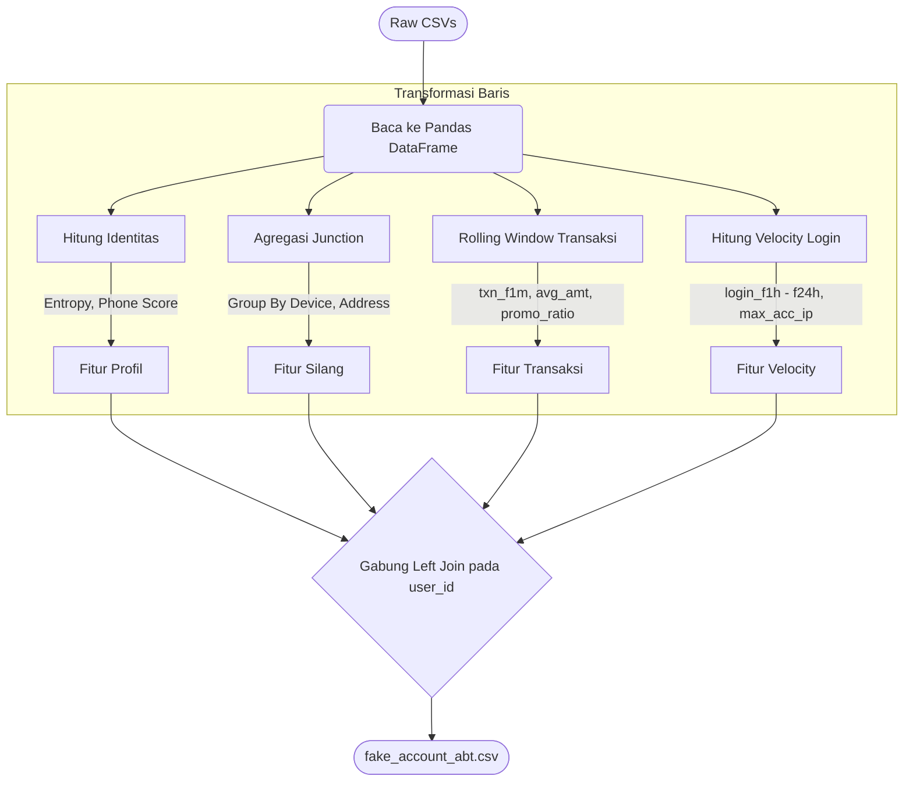
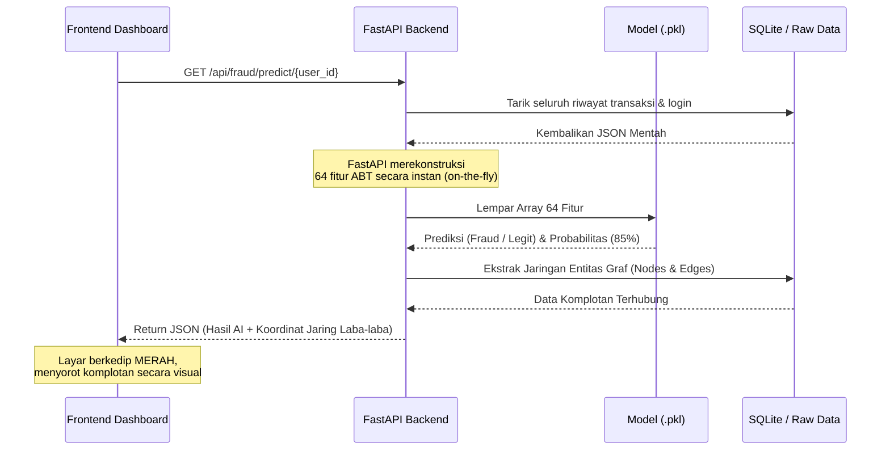

# 🌊 Alur Pengolahan ABT (ABT Processing Flow)

Dokumen ini menjabarkan perjalanan teknis komprehensif dari proses pembuatan **Analytics Base Table (ABT)**, bagaimana ia dikonsumsi oleh algoritma Machine Learning, hingga bagaimana hasil akhirnya disajikan melalui API untuk *Frontend Dashboard*.

Proses ini terbagi menjadi 3 pilar utama:
1. **Konstruksi ABT** (Agregasi Baris-demi-Baris)
2. **Konsumsi Pelatihan AI** (Pencegahan Kebocoran Data & Eksekusi XGBoost)
3. **Eksekusi Waktu-Nyata** (Inferensi API)

---

## 🛠️ 1. Fase Konstruksi ABT (`build_abt.py`)
Fase ini mengubah *Junction Tables* (relasi 1:N) dan tabel *Event* menjadi format *Flattened* (1 Baris = 1 Pengguna).



**Detail Logika Pengolahan:**
*   **Identitas:** Menghitung anomali nama (*Shannon Entropy*) dan pola keanehan nomor telepon.
*   **Junction:** Melakukan `groupby(device_id).nunique(user_id)` untuk mencari gawai yang dikloning banyak akun.
*   **Waktu:** Mencari jarak menit `transaction_date` ke `registration_date` untuk deteksi *bot* kilat.

---

## 🧠 2. Fase Konsumsi Machine Learning (`train_model.py`)
Di tahap ini, ABT akan dibelah dan dicerna oleh algoritma XGBoost. Ini adalah fase paling kritis untuk mencegah *Data Leakage*.

```mermaid
flowchart TD
    A([fake_account_abt.csv]) --> B[Drop Kolom Non-Fitur]
    B --> |Buang: user_id, email, phone| C(Pemisahan Data)
    
    C --> D1[Data Latih / Train - 80%]
    C --> D2[Data Uji / Test - 20%]
    
    subgraph Rekalkulasi Graf (Mencegah Leakage)
    D1 --> E1[Bangun Graf HANYA dari Node Data Latih]
    E1 --> E2[Ekstrak ulang graph_degree, comp_size]
    E2 --> F1[Training Features]
    end
    
    F1 --> G{XGBoost Classifier}
    
    D2 --> F2[Gunakan Skor Graf Masa Lalu]
    F2 --> G
    
    G --> |Latih Pola| H(Evaluasi Akurasi, Precision, Recall)
    H --> I([fake_account_model.pkl])
    G --> J([feature_columns.json])
```

**Detail Logika Pengolahan:**
*   **Drop ID:** Semua kolom ID (seperti `user_id`) wajib dibuang agar model tidak menghafal ID spesifik pengguna, melainkan mempelajari polanya.
*   **Leakage Fix:** Skor graf untuk data ujicoba (*test*) menggunakan metrik node dari masa lalu (sebelum data masa depan dipisahkan).
*   **Output:** Menghasilkan `.pkl` (otak AI) dan `.json` (urutan input baku).

---

## ⚡ 3. Fase Inferensi & API (`model_service.py` / `export_graph_api.py`)
Ini adalah alur ketika tim Operasional menggunakan *Dashboard* di web untuk melakukan investigasi akun secara langsung (*live*).



**Detail Logika Pengolahan:**
*   **On-The-Fly ABT:** Saat API dipanggil untuk 1 akun, *backend* TIDAK membaca `fake_account_abt.csv` statis, melainkan merakit ulang metrik *velocity* & *rolling window* langsung dari database, sehingga hasilnya *Up-to-the-Second* aktual.
*   **Graph Response:** Selain mengembalikan probabilitas AI, API juga melempar data struktural tetangga (*Nodes* & *Edges*) sehingga Frontend (React) bisa menggambar *Network Graph* visual di layar investigator.
