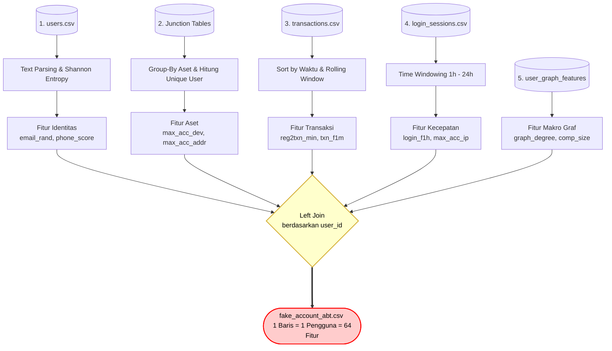

# 🌊 Cara Tabel Mentah Diolah Menjadi ABT

Dokumen ini menjelaskan **bagaimana persisnya logika perhitungan (manipulasi baris dan kolom)** yang dikenakan pada setiap tabel mentah Anda untuk menghasilkan fitur-fitur pendeteksi *fraud* di dalam **Analytics Base Table (ABT)**.

Semua proses di bawah ini terjadi di dalam *script* `build_abt.py` menggunakan pustaka **Pandas**.

---

## 🗺️ Visualisasi Alur Pemrosesan (*Data Processing Flow*)

Berikut adalah diagram visual yang merangkum bagaimana 5 grup tabel mentah dimanipulasi dengan operasi matematika hingga akhirnya digabung menjadi satu tabel ABT raksasa:

---

## 🔬 Detail Logika Manipulasi (*Pandas Operations*)

### 1. Pengolahan Tabel Identitas (`users.csv`)
Tabel ini berisi profil dasar. Karena *bot* sering menggunakan nama palsu, kita harus mengekstrak keanehan pada teksnya.
*   **Manipulasi:** Membelah teks pada kolom `email` menjadi bagian *nama* dan *domain* (misal: `joko99@gmail.com` dibelah).
*   **Perhitungan Matematika:**
    *   **Shannon Entropy (`email_rand`):** Menghitung seberapa acak susunan huruf di nama email. Manusia biasanya punya pola huruf bisa dibaca, *bot* sering pakai huruf acak (seperti `asdfqwer`).
    *   **Rasio Angka (`email_num_ratio`):** Menghitung proporsi angka di dalam nama email. *Bot* sering memakai nomor urut.
    *   **Phone Score (`phone_score`):** Mencari pola angka repetitif (seperti `0811111111`) di kolom `phone_number`.

### 2. Pengolahan Tabel Aset / Junction (`user_devices.csv`, dll)
Sindikat penipu selalu menghemat biaya dengan cara menggunakan 1 *Handphone* atau 1 Alamat untuk puluhan akun palsu.
*   **Target Tabel:** `user_devices.csv`, `user_addresses.csv`, `user_payments.csv`.
*   **Manipulasi Pandas:** Melakukan **Group-By** berdasarkan ID Aset (contoh: `df.groupby('device_id')`).
*   **Perhitungan:** Mengkalkulasi jumlah akun unik (`nunique(user_id)`) yang menempel pada aset tersebut.
*   **Penggabungan (*Join*):** Nilai hasil hitungan tersebut ditempelkan kembali ke masing-masing pengguna.
*   **Hasil Fitur:** Terciptalah fitur `max_acc_dev` (Berapa akun maksimal yang menempel di perangkat orang ini?), `max_acc_addr`, dan `max_acc_pay`.

### 3. Pengolahan Tabel Log Transaksi (`transactions.csv` & `vouchers.csv`)
Pola belanja penipu sangat berbeda dengan pengguna organik. Penipu biasanya langsung memborong sesaat setelah mendaftar demi mengeksploitasi *voucher* pengguna baru.
*   **Manipulasi:** Mengurutkan tabel berdasarkan waktu (`transaction_date`), lalu melakukan **Join** dengan tabel `users` untuk membandingkan waktu daftar dengan waktu transaksi.
*   **Perhitungan Jarak Waktu (`reg2txn_min`):** Mengurangi cap waktu transaksi PERDANA dengan cap waktu pendaftaran (`registration_date`). Semakin kecil menitnya (contoh: transaksi 1 menit setelah daftar), semakin tinggi risiko *bot*.
*   **Perhitungan Mundur (*Rolling Window*):** Memfilter baris dari hari ini ditarik mundur ke 1 bulan hingga 6 bulan ke belakang. Lalu menghitung total transaksi (`txn_f1m`) dan rata-rata belanjanya (`avg_amt1m`).
*   **Perhitungan Promosi (`promo_ratio`):** Menghitung rasio berapa kali kolom `voucher_id` tidak kosong dibandingkan total seluruh transaksinya.

### 4. Pengolahan Tabel Aktivitas (`login_sessions.csv`)
*Bot* penipu dijalankan oleh skrip otomatis yang menyebabkan ratusan *login* terjadi dalam hitungan jam (biasanya tengah malam).
*   **Manipulasi Velocity:** Menggunakan fungsi jendela waktu (*Time Windowing*) untuk memfilter cap waktu `login_timestamp`.
*   **Perhitungan Kecepatan (`login_f1h`, `login_f24h`):** Menghitung agregasi jumlah baris sesi *login* dari pengguna tersebut murni hanya untuk 1 jam, 6 jam, 12 jam, dan 24 jam terakhir. Jika skor `login_f1h`-nya meledak tak wajar, ini adalah indikasi sindikat *farming*.
*   **Manipulasi IP:** Sama seperti perangkat, kita melakukan *Group-By* terhadap `ip_address` untuk melihat berapa akun yang *login* dari IP Wi-Fi yang persis sama (`max_acc_ip`).

### 5. Pengolahan Tabel Relasi Jaringan (`user_graph_features.csv`)
Fitur ini dihitung terlebih dahulu oleh `build_graph.py` menggunakan Ilmu Graf (NetworkX).
*   **Manipulasi Eksternal:** Mengubah tabel *junction* menjadi garis-garis koneksi (*Bipartite Graph*), lalu memproyeksikannya menjadi jaringan murni antar-manusia (*User-to-User*).
*   **Perhitungan Graf:**
    *   **Degree (`graph_degree`):** Menghitung berapa banyak akun lain yang terhubung secara fisik (lewat alat/alamat yang sama) dengan pengguna ini.
    *   **Component Size (`comp_size`):** Menelusuri rantai koneksi sampai ujung untuk menghitung ukuran total populasi sindikat tempat pengguna ini berada.
*   **Penggabungan:** Skrip `build_abt.py` tinggal melakukan *Left Join* satu-ke-satu pada `user_id` untuk memasukkan skor "mafia" ini ke baris ABT pengguna.
