<!--
Purpose: Trace data lineage from synthetic generation through graph features, ABT, model, API, and dashboard.
Used by: Developers and reviewers auditing end-to-end data consistency.
Main dependencies: generate_data.py, generate_graph_data.py, extract_graph_features.py, build_abt.py, train_model.py.
Public/main functions: N/A documentation only.
Side effects: None.
-->

# Feature Lineage: Kisah Penjahitan Data (Data Weaving Story)

Dokumen ini tidak sekadar berisi daftar teknis, melainkan menceritakan "alur jahit" bagaimana data mentah (raw) dipintal, diekstrak, hingga membentuk **Analytics Base Table (ABT)** yang menjadi bahan bakar utama bagi otak kecerdasan buatan (Machine Learning).

## 🗺️ Peta Visual Aliran Data (Data Flow Pipeline)

```text
[ 1. DATA GENERATION ]
(generate_data.py)
       │
       ├──▶ users.csv
       ├──▶ login_sessions.csv, transactions.csv
       └──▶ user_devices.csv, dll (Junction Tables)
              │
              ▼
[ 2. GRAPH EXTRACTION ]
(generate_graph_data.py --mode csv & extract_graph_features.py)
              │
              ├──▶ graph_nodes.csv & graph_edges.csv
              └──▶ user_graph_features.csv (Metrics)
              │
              ▼
[ 3. ABT ASSEMBLY ]
(build_abt.py)
              │
(All raw data + graph features are merged here)
              │
              ▼
    [ fake_account_abt.csv ] (Master Data)
              │
              ├──▶ (alur ke AI)
              │       ▼
              │  [ 4. MACHINE LEARNING ]
              │  (train_model.py)
              │       │
              │       └──▶ fake_account_model.pkl
              │
              └──▶ (alur ke UI)
                      ▼
                 [ 5. API & DASHBOARD ]
                 (generate_graph_data.py --mode api & FastAPI)
                      │
                      └──▶ graph_nodes.json & edges.json
```

### 📋 Tabel Ringkasan Matriks Aliran Data

Jika dijabarkan ke dalam bentuk matriks (kolom), aliran kerja dari hulu ke hilir tampak seperti berikut:

| Fase | Aktor (Script Utama) | Sumber Data (Input) | Hasil Akhir (Output) | Tujuan Utama |
| :--- | :--- | :--- | :--- | :--- |
| **1. Fase Simulasi & Penciptaan Data** *(Data Generation)* | `generate_data.py` | *(Simulator Internal)* | `users.csv`, `transactions.csv`, `login_sessions.csv`, `devices.csv`, `addresses.csv`, `payments.csv`, `vouchers.csv`, `user_devices.csv`, `user_addresses.csv`, `user_payments.csv` | Menciptakan puluhan ribu baris data relasional yang mensimulasikan pola pengguna normal (logis) serta pola sindikat penipu (berbagi *device*, *burst login* massal). |
| **2. Fase Pemetaan Jaring Sindikat** *(Graph Extraction)* | `generate_graph_data.py --mode csv` & `extract_graph_features.py` | `user_devices.csv`, `user_addresses.csv`, `user_payments.csv`, `login_sessions.csv` | `graph_nodes.csv` (Titik entitas), `graph_edges.csv` (Garis koneksi), `user_graph_features.csv` (Metrik numerik spt `graph_cluster_size`) | Memetakan jaringan persekongkolan tak kasat mata melalui alat yang dipakai bersama, lalu mengonversinya menjadi metrik *Graph Theory* untuk tiap pengguna. |
| **3. Fase Perakitan Fitur Cerdas** *(Feature Eng. & ABT)* | `build_abt.py` | Seluruh *Raw CSV* (Tahap 1) & `user_graph_features.csv` (Tahap 2) | `fake_account_abt.csv` (Analytics Base Table) | Menggabungkan fitur identitas, metrik graf, bucket frekuensi login harian (`login_v*`), dan metrik transaksi bulanan ke dalam satu tabel datar (*flattened table*) siap latih. |
| **4. Fase Ruang Belajar AI** *(Model Training & Inference)* | `train_model.py` & `run_inference.py` | `fake_account_abt.csv` | `fake_account_model.pkl` (Otak AI) beserta `feature_columns.json` (Daftar urutan input) | Memisahkan data latih/uji, melatih algoritma (XGBoost, RF), menyeleksi fitur paling penting, dan menciptakan mesin AI pendeteksi *fraud* otonom. |
| **5. Fase Ekspor Visual & API** *(Dashboard Integration)* | `generate_graph_data.py --mode api` & FastAPI | `fake_account_abt.csv`, `graph_nodes.csv`, `graph_edges.csv`, model `.pkl` | `graph_nodes.json`, `graph_edges.json`, & Endpoint REST API `/api/graph` | Menerjemahkan hasil deteksi AI dan struktur graf menjadi JSON visual (*Frontend*) agar tim investigator bisa melihat jaringan sindikat secara langsung. |

---

## 🏗️ 1. Fase Simulasi & Penciptaan Data (Data Generation)
**Aktor:** `scripts/generate_data.py`

Semuanya bermula dari *Simulator* yang menciptakan alam semesta berisiko ini. Skrip ini secara probabilistik menghasilkan ribuan entitas fiktif namun dengan perilaku serealistis mungkin:
*   **Data Utama:** Menciptakan `users.csv` (identitas), `devices.csv`, `addresses.csv`, `payments.csv`, dan `vouchers.csv`.
*   **Data Transaksional & Log:** Menciptakan `transactions.csv` dan `login_sessions.csv`. Di sinilah simulator secara cerdas menyuntikkan *Persona Waktu* (misal: bot penipu cenderung melakukan *burst login* massal di jam 2 pagi).
*   **Junction Tables:** Menciptakan tabel penghubung `user_devices.csv`, `user_addresses.csv`, dsb. Di sinilah akar dari sindikat penipuan ditanam (beberapa *user* dipaksa berbagi *device* atau alamat yang sama).

---

## 🕸️ 2. Fase Pemetaan Jaring Sindikat (Graph Extraction)
**Aktor:** `scripts/generate_graph_data.py --mode csv` & `scripts/extract_graph_features.py`

Sebelum data dihitung secara tradisional, kita mengekstrak pola "tak kasat mata" dari data relasional tersebut menggunakan Ilmu Graf (*Graph Theory*):
*   **Penciptaan Node & Edge:** Skrip `generate_graph_data.py --mode csv` membaca file *junction* dari folder `data/raw/` (seperti `user_devices.csv`, `user_payments.csv`, dan IP dari `login_sessions.csv`). Skrip ini kemudian mengubahnya menjadi format baku graf: `graph_nodes.csv` (Daftar titik/entitas) dan `graph_edges.csv` (Garis penghubung antar titik).
*   **Bipartite Graph & Projection:** Skrip `extract_graph_features.py` kemudian mengambil file *nodes* dan *edges* tersebut untuk membangun **Bipartite Graph** (Grafik Dua Sisi) untuk menghubungkan User <-> Alat.
*   Lalu dikonversi menjadi **User-to-User Graph**. Jika Budi dan Andi sama-sama pernah login dari HP Xiaomi yang sama, mereka otomatis ditarik garis merah (terkoneksi).
*   **Hasil:** Skrip ekstrak akan menghasilkan file `data/processed/user_graph_features.csv` yang berisi fitur struktural murni (seperti ukuran komplotan dan kepadatan irisan).

> *Catatan Tambahan: Di akhir proses (Fase 5), mode `generate_graph_data.py --mode api` dipanggil setelah ABT selesai agar `graph_nodes.json` berisi metadata user terbaru seperti `risk_score`, `risk_category`, dan `ftype`.*

---

## 🏭 3. Fase Perakitan Fitur Cerdas (Feature Engineering & ABT)
**Aktor:** `scripts/build_abt.py`

Ini adalah "Pabrik Perakitan" sesungguhnya. Skrip ini membaca *semua* file dari `data/raw/` dan menyatukannya dengan `user_graph_features.csv` untuk dirajut menjadi satu garis lurus (*flattened*). 

### 🗂️ Relasi Penggabungan Tabel (Table Join Relations)
Untuk merakit ABT, skrip akan melakukan penggabungan (*join/merge*) dengan `users` sebagai pusat tata surya (titik jangkar). Berikut adalah diagram relasi (*Entity Relationship*) dari tabel-tabel mentah yang digabungkan:

```mermaid
erDiagram
    %% Core Entity
    users {
        string user_id PK
        string email
        string phone_number
        date registration_date
    }

    %% Base Entities
    devices {
        string device_id PK
        string device_type
        string os_version
    }
    addresses {
        string address_id PK
        string city
        string postal_code
    }
    payments {
        string payment_id PK
        string payment_method
        string card_bin
    }
    vouchers {
        string voucher_id PK
        float discount_value
        string campaign_name
    }

    %% Junction Tables (Many-to-Many Relationships)
    user_devices {
        string user_id FK
        string device_id FK
        date link_date
    }
    user_addresses {
        string user_id FK
        string address_id FK
        date link_date
    }
    user_payments {
        string user_id FK
        string payment_id FK
        date link_date
    }

    %% Log / Event Tables
    transactions {
        string transaction_id PK
        string user_id FK
        string voucher_id FK
        float amount
        date transaction_date
    }
    login_sessions {
        string session_id PK
        string user_id FK
        string ip_address
        date login_timestamp
    }
    
    %% Relationships & Graph Edges
    referrals {
        string referrer_user_id FK
        string referred_user_id FK
        date referral_date
    }
    user_graph_features {
        string user_id FK
        int graph_degree
        int comp_size
        int shared_ip_count
    }

    %% Relationships Mapping
    users ||--o{ user_devices : "has (1:N)"
    devices ||--o{ user_devices : "used by (1:N)"
    
    users ||--o{ user_addresses : "registers (1:N)"
    addresses ||--o{ user_addresses : "belongs to (1:N)"
    
    users ||--o{ user_payments : "adds (1:N)"
    payments ||--o{ user_payments : "owned by (1:N)"
    
    users ||--o{ transactions : "makes (1:N)"
    vouchers ||--o{ transactions : "applied to (1:N)"
    
    users ||--o{ login_sessions : "performs (1:N)"
    
    users ||--o{ referrals : "invites (1:N)"
    
    users ||--|| user_graph_features : "mapped to (1:1 graph score)"
```



Berikut adalah **Silsilah Detail (Lineage Mapping)** dari mana setiap kolom di ABT diciptakan berdasarkan relasi di atas:

### A. Fitur Identitas & Profil
Diambil langsung dari tabel **`users.csv`**.
*   **`email_len`, `email_num_ratio`, `email_rand`**: Berasal dari pembedahan kolom `email`. Mengukur panjang email, rasio kemunculan angka di dalam nama email (karena *bot* suka pakai angka acak `joko89237@gmail.com`), dan probabilitas keacakan susunan huruf (*Shannon Entropy*).
*   **`disp_email`**: Flagging otomatis jika domain di kolom `email` masuk daftar domain sampah buang-pakai (seperti `@yopmail.com`).
*   **`phone_score`**: Mengukur tingkat anomali (terlalu banyak angka berulang / panjang tidak wajar) dari kolom `phone_number`.

### B. Fitur Perangkat & Relasi Lintas Entitas (Cross-Entity)
Diambil dengan cara menghitung agregasi pada file **Junction Tables**.
*   **`max_acc_dev` (Max Account per Device)**: Menarik data dari `user_devices.csv`. Dihitung dengan cara mengelompokkan `device_id` lalu menghitung jumlah unik `user_id` yang pernah menempel di HP tersebut.
*   **`max_acc_addr`, `max_acc_pay`**: Metodologinya persis sama, namun menarik data *junction* dari `user_addresses.csv` (banyak user pakai 1 alamat kirim) dan `user_payments.csv` (banyak user pakai 1 OVO yang sama).

### C. Fitur Riwayat Transaksi & Perilaku Voucher
Diambil dari penyatuan tabel **`transactions.csv`**, **`vouchers.csv`**, dan **`users.csv`**.
*   **`promo_ratio`**: Berasal dari total baris di `transactions.csv` yang kolom `voucher_id`-nya tidak kosong, lalu dibagi dengan total seluruh transaksi pengguna tersebut.
*   **`reg2txn_min`**: Selisih waktu (dalam satuan menit) yang diambil dengan cara mengurangi `transaction_date` paling pertama di `transactions.csv` dengan `registration_date` milik pengguna di `users.csv`. Semakin cepat waktunya, semakin mirip *bot*.
*   **`txn_f1m` hingga `txn_f6m`**: Fitur *Rolling Window* yang menyaring baris `transactions.csv` milik *user*. Ia menghitung jumlah order (`txn`), nilai rupiahnya (`amt`), dan nilai diskonnya (`promo`) secara mundur ke belakang untuk jendela 1 hingga 6 bulan.

### D. Fitur Frekuensi Login Harian
Diambil murni dari tabel **`login_sessions.csv`**.
*   **`login_v1h` hingga `login_v24h`**: *Daily login frequency buckets*. Menghitung maksimum jumlah login user dari jam `00:00` sampai batas jam tertentu pada hari tersibuknya. Contoh: `login_v1h` menghitung login dari `00:00` sampai `01:00`; `login_v24h` menghitung maksimum total login harian user.
*   **`max_acc_ip`**: Membalik sudut pandang. Dikelompokkan berdasarkan `ip_address`, lalu dihitung jumlah unik `user_id` yang masuk ke IP itu. Kemudian nilainya ditempelkan kembali ke setiap *user*.

### E. Fitur Jaringan Jauh (Macro Graph Features)
Diambil dari hasil karya skrip Fase 2 yaitu **`user_graph_features.csv`**.
*   **`degree`**: Seberapa banyak "tali silaturahmi" merah (cabang koneksi) yang dimiliki satu *user* ke *user* penipu lainnya. 
*   **`comp_size`**: Ukuran *Connected Component*. Jika ada 500 akun yang diam-diam terhubung secara berantai lewat alat bayar dan alamat pengiriman berlapis, angkanya akan meledak menjadi 500. Fitur ini paling ditakuti oleh sindikat pabrik akun.
*   **`shared_ip_count`**: Mengkalkulasi akumulasi jumlah irisan IP antara *user* tersebut dengan seluruh lingkaran teman-teman terdekatnya (*neighbors* di dalam Graf).

**Hasil:** Master Table raksasa bernama `data/abt/fake_account_abt.csv`. Di tabel inilah, satu pengguna direpresentasikan oleh **1 Baris dengan 69 Kolom Total**: 64 kolom fitur model dan 5 kolom metadata/label (`uid`, `fraud`, `ftype`, `risk_score`, `risk_cat`).

---

## 🧠 4. Fase Pelatihan & Pencegahan Kebocoran (Model Training)
**Aktor:** `scripts/train_model.py`

Master Table ABT kini dimasukkan ke dalam ruang kelas Machine Learning (Algoritma **XGBoost**):
*   **Data Leakage Fix:** Saat membelah data menjadi *Training* (Buku Pelajaran) dan *Testing* (Ujian), skrip ini dengan sangat cermat **menghitung ulang fitur Graf secara terisolasi** hanya untuk data *Training*. Ini memastikan XGBoost tidak "menyontek" pola jaringan dari masa depan.
*   **Feature Importance:** XGBoost mempelajari korelasi kompleks dari ke-64 fitur dan memutuskan bobot mana yang paling akurat mencirikan penipu.

---

## ⚡ 5. Fase Pelayanan Waktu Nyata (Real-time Prediction API)
**Aktor:** `backend/app/services/model_service.py`

Kisah ini berujung pada peluncuran di dunia nyata:
*   Saat server (FastAPI) dinyalakan, ia akan memuat (load) otak AI (`.pkl`) ke dalam memori *(RAM)*.
*   **Dynamic Prediction:** Setiap kali Tim Investigasi membuka profil pengguna (misal: memanggil `/api/user/USR09427`), sistem akan merangkum ulang ke-64 fitur pengguna tersebut dari Database, lalu *menembakkannya* secara *real-time* ke otak AI di memori.
*   Sistem kemudian mengadu probabilitas AI (`74% Fake`) dengan logika klasik/Rule-Based manusia (`Skor 45`).

**Hasil Akhir:** Sebuah sinyal bahaya (Alarm) dan laci investigasi visual yang muncul di layar **React Frontend Dashboard** untuk diinvestigasi oleh Tim Operasional Alfagift.
