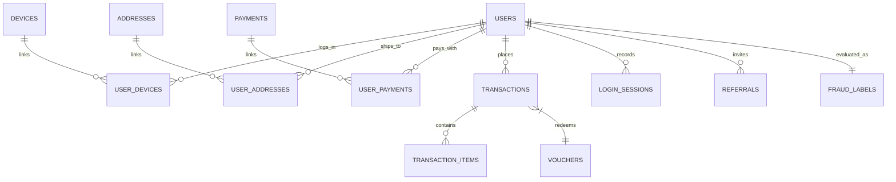
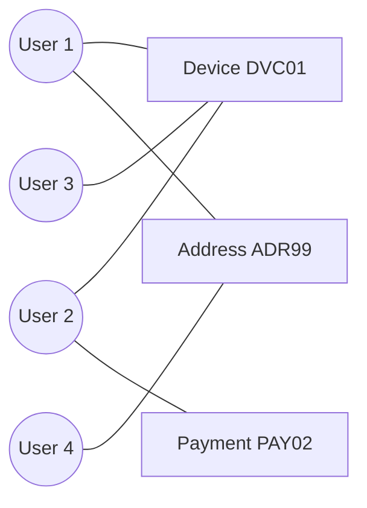

<!--
Purpose: Provide a presentation-ready explanation of the fraud detection prototype.
Used by: Project reviewers, demo presenters, and documentation readers.
Main dependencies: generated CSV schema, ABT, model artifacts, backend/frontend architecture.
Public/main functions: N/A documentation only.
Side effects: None.
-->

# 📊 Presentasi Detail Proyek: Prototype Deteksi Akun Palsu (Fake Account Detection)
> **Sistem Analisis Berbasis Machine Learning, Graph Analytics, & Asisten AI Chatbot untuk Retail E-Commerce Mobile (Alfagift)**

---

## 🏗️ Slide 1: Arsitektur Sistem & Alur Kerja (Workflow)
Sistem deteksi akun palsu ini dirancang dengan arsitektur end-to-end yang memadukan pemrosesan data, machine learning, dan antarmuka interaktif.

### 🔄 Alur Kerja Sistem (Workflow)

1. 📥 **Data Synthetic** 
   ⬇️
2. ⚙️ **Data Extraction & Preprocessing**
   ⬇️
3. 🔬 **Feature Engineering**
   ┣━━ 📊 *Relational Data* ➔ **Tabular Features** *(Profile, Behavior)*
   ┗━━ 🕸️ *Graph Data* ➔ **Network Features** *(Shared Devices, IPs)*
   ⬇️
4. 🗄️ **Analytics Base Table (ABT)** *(Penyatuan Data)*
   ⬇️
5. 🧠 **Machine Learning Model** *(Logistic Regression / XGBoost)* & 🛡️ **Heuristic Rule-Based Engine**
   ⬇️
6. 🎯 **Risk Decision & Category** *(High / Medium / Low)*
   ⬇️
7. 🚀 **Sistem Terintegrasi:**
   ┣━━ ⚡ **FastAPI Backend Services**
   ┣━━ 💻 **Next.js Dashboard UI**
   ┗━━ 🤖 **LLaMA-3.1 AI Chatbot**

### 🏢 Komponen Utama Arsitektur:
1.  **Data Layer (Storage & Extraction):** 
    *   Data transaksi dan interaksi e-commerce (Alfagift) disimpan di database PostgreSQL.
    *   Data diproses menggunakan Python (Pandas & NetworkX) untuk membangun *Analytics Base Table* (ABT).
2.  **Machine Learning & Analytics Layer:**
    *   **Feature Engineering:** Transformasi data mentah menjadi fitur analitik (profil, perilaku transaksi, dan metrik jaringan).
    *   **Predictive Model:** Algoritma ML mengkalkulasi probabilitas *fraud* akun.
    *   **Rule-Based Engine:** Penilaian risiko ganda menggunakan aturan bisnis (*heuristics*) seperti deteksi *emulator* atau aktivitas mencurigakan.
3.  **Backend Services (FastAPI):**
    *   Menyediakan REST API cepat untuk melayani endpoint prediksi secara *real-time*.
    *   Menangani perutean data dan integrasi LLM Chatbot via Groq API.
4.  **Frontend & AI Layer (Next.js):**
    *   Antarmuka web interaktif untuk pemantauan dasbor admin.
    *   Visualisasi analitik graf dan interaksi *natural language* melalui AI Assistant.

---

## 🖥️ Slide 2: Ringkasan Proyek & Business Problem
Aplikasi belanja mobile retail modern seperti **Alfagift** sering menjadi target eksploitasi oleh pelaku kecurangan (*fraudsters*). Proyek ini membangun sistem deteksi terpadu untuk melindungi anggaran promo perusahaan.

### 🚨 5 Skenario Kecurangan Utama yang Dideteksi
1.  **Shared Device Abuse:** Satu perangkat fisik (HP) digunakan bergantian oleh puluhan akun palsu untuk mengklaim promo secara beruntun.
2.  **Shared Address Abuse:** Pengiriman hadiah/barang promo dari puluhan akun palsu ditujukan ke satu alamat pengiriman yang sama (sarang penimbunan barang diskon).
3.  **Shared Payment Abuse:** Penggunaan satu metode pembayaran (misal e-wallet/kartu debit) yang sama untuk puluhan akun pengguna baru.
4.  **Voucher Farming:** Pendaftaran massal akun-akun yang hanya aktif sekali untuk menghabiskan voucher gratis ongkir/potongan harga pengguna baru, setelah itu akun ditinggalkan (*dormant*).
5.  **Referral Ring:** Manipulasi pendaftaran bertingkat di mana Akun A mengundang Akun B, B mengundang C, dan C mengundang A kembali secara melingkar untuk mencairkan hadiah undangan.

---

## 🗄️ Slide 3: Desain Schema Database Relasional (13+1 Tabel)
Data simulasi belanja selama 6 bulan disimpan dalam database PostgreSQL (Supabase) dengan struktur relasional yang ketat:



### Rincian Isi & Deskripsi Tabel Database:

| Nama Tabel | Fungsi & Deskripsi | Kolom Utama (Contoh Isi Data) |
| :--- | :--- | :--- |
| **`users`** | Profil utama pengguna yang terdaftar di aplikasi. | `user_id`, `name`, `email`, `phone_number`, `is_verified` |
| **`devices`** | Identitas fisik dan spesifikasi perangkat keras (HP). | `device_id`, `device_fingerprint`, `device_type`, `os_version` |
| **`user_devices`** | Tabel penghubung untuk mendeteksi HP yang dipakai bergantian. | `user_id`, `device_id`, `last_login` |
| **`addresses`** | Master titik alamat pengiriman barang & koordinat. | `address_id`, `city`, `province`, `latitude`, `longitude` |
| **`user_addresses`** | Tabel penghubung untuk mendeteksi sindikat pengiriman massal. | `user_id`, `address_id`, `is_primary` |
| **`payments`** | Master instrumen pembayaran keuangan (e-wallet/kartu). | `payment_id`, `payment_method`, `masked_payment_number` |
| **`user_payments`** | Tabel penghubung mendeteksi pemakaian 1 rekening oleh banyak akun. | `user_id`, `payment_id` |
| **`vouchers`** | Katalog promosi, syarat, limit, dan jenis voucher. | `voucher_id`, `promo_category`, `discount_amount`, `min_spend` |
| **`transactions`** | Data riwayat pemesanan utama / nota (*header*). | `transaction_id`, `user_id`, `voucher_id`, `total_amount` |
| **`transaction_items`** | Rincian barang belanjaan dalam pesanan (*detail*). | `transaction_id`, `product_id`, `category`, `quantity`, `price` |
| **`login_sessions`** | Rekaman histori aktivitas masuk untuk melacak *bot*. | `session_id`, `user_id`, `login_timestamp`, `ip_address`, `login_persona` |
| **`referrals`** | Data undangan untuk melacak kecurangan *referral ring*. | `referral_id`, `referrer_user_id`, `referred_user_id` |
| **`fraud_labels`** | Target variabel (*ground truth*) status keaslian akun. | `user_id`, `is_fake_account`, `fraud_type` |

### Tabel Analitik Akhir (ABT)
| Nama Tabel | Fungsi & Deskripsi | Kolom Utama (Contoh Isi Data) |
| :--- | :--- | :--- |
| **`fake_account_abt`** | *Analytics Base Table*: Tabel master hasil akhir penyatuan raw features dan graph aggregate features. Siap dikonsumsi langsung oleh algoritma *Machine Learning*. | Berisi fitur turunan seperti `promo_ratio`, `max_acc_dev`, `login_v1h`, `degree`, dll. |

---

## 🧬 Slide 4: Rekayasa Fitur & Formulasi (Feature Engineering)
Untuk mendeteksi akun palsu, data dari tabel-tabel mentah diekstrak menjadi **puluhan fitur prediktif** per pengguna.

<details>
<summary><b>Klik untuk melihat rincian fitur beserta asal tabelnya:</b></summary>

### 1. Fitur Identitas (Identity Features)
| Nama Fitur | Asal Tabel Mentah | Deskripsi Singkat | Kasus Fraud yang Dideteksi |
| :--- | :--- | :--- | :--- |
| `email_numeric_ratio` | `users` | Rasio angka di *username* email (contoh: budi12345). | Pendaftaran massal menggunakan *email generator*. |
| `email_randomness_score`| `users` | Tingkat keacakan (Shannon Entropy) huruf email. | Email abal-abal huruf acak (contoh: asdjkqw@). |
| `is_disposable_email_domain`| `users` | Penggunaan email sementara (misal: yopmail, mailinator). | Pendaftaran akun sekali pakai untuk ambil voucher. |
| `phone_pattern_score` | `users` | Angka nomor HP yang terlalu sering berulang. | Bot yang memalsukan dan merandom nomor HP. |

### 2. Fitur Perangkat (Device Features)
| Nama Fitur | Asal Tabel Mentah | Deskripsi Singkat | Kasus Fraud yang Dideteksi |
| :--- | :--- | :--- | :--- |
| `max_acc_dev`| `user_devices` | Akun maksimal yang pernah *login* di satu HP fisik. | *Shared Device Abuse* (1 HP dipakai puluhan akun). |

### 3. Fitur Alamat & Pembayaran (Shared Entities)
| Nama Fitur | Asal Tabel Mentah | Deskripsi Singkat | Kasus Fraud yang Dideteksi |
| :--- | :--- | :--- | :--- |
| `max_acc_addr`| `user_addresses`, `addresses` | Jumlah akun dengan alamat pengiriman sama. | Sindikat penimbun promo di satu markas pengiriman. |
| `max_acc_pay`| `user_payments`, `payments` | Jumlah akun yang memakai kartu/e-wallet persis sama. | *Shared Payment Abuse* (Dimodali oleh satu orang). |

### 4. Fitur Transaksi & Promo (Transaction Features)
| Nama Fitur | Asal Tabel Mentah | Deskripsi Singkat | Kasus Fraud yang Dideteksi |
| :--- | :--- | :--- | :--- |
| `promo_ratio` | `transactions`, `vouchers` | Persentase order memakai voucher dibanding total belanja. | *Promo hunting* (Hanya transaksi saat diskon). |
| `reg2txn_min`| `users`, `transactions` | Jeda waktu (menit) dari register sampai *checkout* pertama. | Bot eksekusi instan tanpa *browsing* produk (<5 menit). |
| `[metric]_last_1m_3m_6m` | `transactions` | Agregasi total/rata-rata order dalam periode waktu. | Memantau lonjakan mendadak akun yang sebelumnya pasif. |

### 5. Fitur Frekuensi Aktivitas Login
| Nama Fitur | Asal Tabel Mentah | Deskripsi Singkat | Kasus Fraud yang Dideteksi |
| :--- | :--- | :--- | :--- |
| `login_v1h` hingga `login_v6h` | `login_sessions` | Maksimum login dari `00:00` sampai jam 1-6 pada hari tersibuk user. | Aktivitas login padat setelah tengah malam. |
| `login_v12h` & `login_v18h` | `login_sessions` | Maksimum login dari `00:00` sampai jam 12 dan 18 pada hari tersibuk user. | Akun yang sering dioperasikan / dibagikan (*account sharing*) harian. |
| `login_v24h` | `login_sessions` | Maksimum total login harian user. | Ketergantungan aktivitas login harian. |
| `max_acc_ip` | `login_sessions` | Maksimal pengguna masuk dari satu alamat IP internet. | Markas komplotan pencari promo via satu koneksi Wi-Fi. |

### 6. Fitur Jaringan (Graph & Referral Features)
| Nama Fitur | Asal Tabel Mentah | Deskripsi Singkat | Kasus Fraud yang Dideteksi |
| :--- | :--- | :--- | :--- |
| `referral_ring_score` | `referrals` | Deteksi jika rantai pengundang melingkar (A->B->C->A). | *Referral fraud* terorganisir pencair hadiah saldo. |
| `cluster`, `comp_size`, `degree` | Semua Relasional | Ukuran ego-network, komponen, dan jumlah koneksi user di graph. | Menilai skala ancaman sindikat secara makro (Big Fraud). |

</details>

### 🔍 Bedah Resep: Bagaimana Fitur ABT Dibuat dari Tabel Mentah?
Untuk memberikan gambaran konkret *Feature Engineering*, berikut adalah rumusan dari 3 fitur utama:

1. **Fitur `promo_ratio` (Skenario Fraud: *Voucher Farming / Promo Hunting*)**
   * **Tabel yang Digabung:** Tabel `transactions` JOIN dengan `vouchers`.
   * **Proses / Rumus:** Menghitung total transaksi milik seorang pengguna yang `voucher_id`-nya terisi, lalu dibagi dengan total seluruh transaksinya.
   * **Menghasilkan:** Persentase (0% - 100%). Akun palsu pencari promo umumnya memiliki rasio di atas 90%.

2. **Fitur `max_acc_dev` (Skenario Fraud: *Shared Device Abuse*)**
   * **Tabel yang Digabung:** Tabel `users` JOIN dengan `user_devices`.
   * **Proses / Rumus:** Dikelompokkan berdasarkan perangkat (`GROUP BY device_id`), dihitung jumlah `user_id` uniknya, lalu diambil angka maksimal untuk pengguna tersebut.
   * **Menghasilkan:** Angka bulat (contoh: 15 akun). Jika 1 HP fisik dipakai oleh 15 akun berbeda, otomatis terdeteksi sebagai anomali.

3. **Fitur `reg2txn_min` (Skenario Fraud: *Bot Eksekusi Instan*)**
   * **Tabel yang Digabung:** Tabel `users` JOIN dengan `transactions`.
   * **Proses / Rumus:** Mencari waktu transaksi pertama (`MIN(transaction_date)`), kemudian dikurangi dengan waktu pendaftaran (`registration_date`).
   * **Menghasilkan:** Durasi dalam satuan menit. Bot otomatis biasanya memiliki jeda kurang dari 5 menit tanpa melakukan *browsing* produk secara wajar layaknya manusia.

---

*Untuk presentasi, berikut adalah **Top 5 Fitur Paling Signifikan (Feature Importance)**:*
1.  **`shared_ip_count`**: Jumlah koneksi berbagi IP yang terdeteksi di graph.
2.  **`max_acc_ip`**: Jumlah akun maksimum yang berbagi IP.
3.  **`comp_size`**: Ukuran komponen jaringan tempat user berada.
4.  **`shared_payment_count`**: Jumlah koneksi berbagi metode pembayaran.
5.  **`reg2txn_min`**: Waktu jeda pendaftaran ke transaksi pertama.

---

## 🕸️ Slide 5: Graph Analytics & Feature Extraction
Graph analytics memetakan hubungan tidak langsung antar-pengguna untuk menemukan pola kecurangan terorganisir yang tidak terlihat oleh tabel biasa.



### Ekstraksi Fitur Graf Menggunakan NetworkX:
Sistem membangun graf proyeksi antar pengguna yang berbagi perangkat, alamat, dan instrumen pembayaran:
1.  **`graph_degree`:** Berapa banyak akun lain yang terhubung langsung dengan pengguna ini melalui data bersama.
2.  **`graph_cluster_size`:** Jumlah total node pengguna dalam ego-jaringan terdekat node tersebut.
3.  **`connected_component_size`:** Jumlah total anggota kelompok jaringan terisolasi (membantu melacak ukuran komplotan *fraudster*).
4.  **`shared_entity_count`:** Bobot akumulasi hubungan (jumlah HP + alamat + kartu pembayaran yang dipakai bersama).

---

## 🧠 Slide 6: Perbandingan Model Machine Learning (Tuning & Evaluasi)
Sistem melatih dan membandingkan tiga algoritma dengan optimalisasi hyperparameter melalui **GridSearchCV (5-Fold Stratified Cross-Validation)**:

| Algoritma | Parameter Terbaik | Akurasi | Presisi (Precision) | Sensitivitas (Recall) | F1-Score | ROC-AUC |
| :--- | :--- | :--- | :--- | :--- | :--- | :--- |
| 🏆 **Logistic Regression** | `C: 1.0, penalty: l2` | **98.73%** | **97.05%** | **98.78%** | **97.91%** | **99.92%** |
| 🥈 **XGBoost** | `learning_rate: 0.05, max_depth: 3` | 97.53% | 97.15% | 94.56% | 95.83% | 99.77% |
| 🥉 **Random Forest** | `n_estimators: 50, max_depth: 5` | 95.23% | 97.25% | 86.56% | 91.59% | 99.20% |

### 🔍 Analisis Matriks Kebingungan (Confusion Matrix) Logistic Regression:
*   **True Negatives (Legitimate terprediksi Normal):** 2.073 akun
*   **False Positives (Legitimate dituduh Palsu/Salah Sasaran):** 27 akun (hanya 1.28%)
*   **False Negatives (Fake lolos Deteksi):** 11 akun
*   **True Positives (Fake berhasil Dideteksi):** 889 akun

> [!IMPORTANT]
> **Data Leakage Fix:** Sebelum training, fitur jaringan (*graph*) dan agregasi kelompok (*shared counts*) dihitung **hanya dari subset training**. Ini mencegah model mengintip relasi data test, menjamin akurasi model tetap konsisten saat dideploy di lingkungan produksi.

---

## 🛡️ Slide 7: Rule-Based Heuristic Risk Scoring
Selain model Machine Learning, sistem menerapkan skor kepatuhan berbasis aturan bisnis (*expert rules*). Skor ini berkisar antara **0 hingga 100** dan digunakan sebagai validasi ganda.

### Aturan Poin Kecurigaan:
*   HP yang sama dipakai oleh >5 akun: **+25 Poin** (jika >2 akun: **+10 Poin**)
*   Alamat yang sama dipakai oleh >5 akun: **+20 Poin**
*   Kartu pembayaran yang sama dipakai oleh >3 akun: **+20 Poin**
*   IP yang sama dipakai oleh >5 akun: **+15 Poin**
*   Domain email sekali pakai (*disposable*): **+15 Poin**
*   Email didominasi angka> 40%: **+10 Poin**
*   Waktu daftar hingga transaksi pertamanya <5 menit: **+10 Poin**
*   Terdeteksi rantai rujukan melingkar (*referral ring*): **+20 Poin**

### Pembagian Kategori Risiko:
*   🔴 **High Risk (Skor > 50):** Akun langsung dibatasi/diblokir dari klaim voucher promo.
*   🟡 **Medium Risk (Skor 20 - 50):** Transaksi membutuhkan verifikasi OTP SMS tambahan.
*   🟢 **Low Risk (Skor < 20):** Pengguna normal, bebas bertransaksi tanpa kendala.

---

## ⚡ Slide 8: Arsitektur API Backend (FastAPI)
Layanan backend dibangun dengan FastAPI untuk melayani dashboard admin secara *real-time*.

### Endpoint Utama API:
1.  `GET /api/stats/overview`
    *   *Fungsi:* Menghitung ringkasan eksekutif dashboard (total akun, laju fraud, kerugian promo terselamatkan).
2.  `GET /api/users`
    *   *Fungsi:* Menampilkan tabel pengguna yang dilengkapi filter pencarian, status risiko, dan filter jenis penyalahgunaan (perangkat/alamat/pembayaran).
3.  `POST /api/predict`
    *   *Fungsi:* Melakukan inference ML pada profil user tertentu atau menerima payload fitur manual.
    *   *Request Payload:*
        ```json
        { "max_acc_dev": 8, "promo_ratio": 0.95, "max_acc_ip": 4 }
        ```
    *   *Response Payload:*
        ```json
        { "prediction": "fake_account", "probability": 0.941, "risk_category": "High" }
        ```
4.  `GET /api/user/{user_id}`
    *   *Fungsi:* Menarik data profil, riwayat deteksi, serta tetangga keterhubungan langsung (daftar HP/kartu bayar/alamat/IP) dari Graph Analytics.
5.  `GET /api/graph`
    *   *Fungsi:* Mengirimkan data nodes & edges JSON untuk dirender menjadi peta jaringan force-directed.

---

## 🤖 Slide 9: Chatbot Asisten AI (LLaMA-3.1 & Fallback)
Chatbot dirancang agar analis kecurangan dapat berkonsultasi perihal riwayat akun menggunakan bahasa sehari-hari.

### 1. Integrasi LLaMA-3.1-8B-Instant (via Groq API)
*   Menerima context data terstruktur dari API Backend dan pertanyaan pengguna.
*   Menghasilkan penjelasan naratif analisis risiko yang mudah dimengerti manajemen dalam bahasa Indonesia yang luwes.

### 2. Mesin Fallback Cerdas (Tanpa API Key Cloud)
*   Jika koneksi internet terputus atau kunci API Groq kosong, chatbot tetap berfungsi penuh.
*   Sistem menggunakan **Regular Expression (Regex) parser** untuk mendeteksi maksud pertanyaan:
    *   *Pola:* `detail user [USR00010]` menarik data profil dan menampilkan poin indikator kecurigaan.
    *   *Pola:* `show top 10` menampilkan daftar pengguna dengan risiko tertinggi dari database.
    *   *Pola:* `berapa rata rata` menghitung rata-rata skor transaksi pengguna.

---

## 💻 Slide 10: Tampilan Dashboard Frontend (Next.js & Tailwind)
Antarmuka visual dirancang premium dengan tema gelap (*dark mode*) yang fungsional:

1.  **Overview Dashboard:**
    *   Widget metrik keuangan (perkiraan promo terselamatkan).
    *   Grafik tren transaksi bulanan dan sebaran jenis kecurangan terdeteksi (menggunakan *Recharts*).
2.  **Tabel Manajemen Risiko (Risk Scoring List):**
    *   Daftar seluruh akun diurutkan dari probabilitas ML tertinggi.
    *   Tombol pencarian cepat dan penyaringan berdasarkan kota atau tipe device.
3.  **Visualizer Peta Jaringan (Force Graph):**
    *   Menggunakan *react-force-graph-2d* berbasis kanvas HTML5.
    *   Setiap jenis node (User, Device, Payment, dll) dibedakan warna dan bentuknya.
    *   Jika node diklik, dashboard memunculkan panel detail profil pengguna di sebelah kanan.
4.  **Sandbox Model Inference:**
    *   Halaman interaktif di mana analis dapat memasukkan nilai parameter fiktif untuk melihat hasil prediksi model ML secara instan.
5.  **AI Assistant Chat Panel:**
    *   Antarmuka obrolan gelembung untuk interaksi real-time dengan asisten AI.

---

## 📂 Slide 11: Struktur Lengkap Folder & Fungsi Filenya
Struktur repositori yang tertata rapi memudahkan kolaborasi antar pengembang backend, frontend, dan data scientist:

*   📂 **`backend/`** — Layanan Web API (Python FastAPI)
    *   📄 `app/main.py`: Titik masuk aplikasi, registrasi modul API, dan pengaturan izin akses CORS.
    *   📂 `app/api/`: Definis rute endpoint (`prediction.py`, `graph.py`, `chatbot.py`).
    *   📂 `app/services/`: Logika bisnis pemrosesan model ML, kalkulasi relasi graf, dan penyusun teks chatbot.
    *   📂 `app/schemas/`: Validasi tipe data input/output API menggunakan Pydantic.
*   📂 **`frontend/`** — Aplikasi Dashboard Web (Next.js)
    *   📂 `pages/` & `components/`: Halaman web dashboard dan komponen UI modular (grafik, peta graf, chat).
    *   📄 `package.json`: Pengaturan pustaka visualisasi (`recharts`, `react-force-graph-2d`).
*   📂 **`data/`** — Folder File Data
    *   📂 `raw/`: 13 file CSV tabel database awal hasil simulasi.
    *   📂 `abt/`: File `fake_account_abt.csv` tabel ringkasan per pengguna.
    *   📂 `processed/`: File JSON nodes dan edges untuk penampil peta jaringan dashboard.
*   📂 **`models/`** — Folder Model Terlatih
    *   📄 `fake_account_model.pkl`: File biner model ML Logistic Regression yang sudah terlatih.
    *   📄 `feature_columns.json`: Daftar urutan nama kolom fitur input model.
*   📂 **`notebooks/`** — Dokumentasi Riset Data (Jupyter Notebook)
    *   Berisi berkas eksperimen interaktif pembentukan data simulasi, analisis data (EDA), rekayasa fitur, model training, dan graf analytics.
*   📂 **`scripts/`** — Skrip Otomatisasi Mandiri
    *   Berisi perintah terminal cepat untuk melakukan training ulang (`train_model.py`), membangun ABT (`build_abt.py`), dan melakukan tes prediksi (`run_inference.py`).
*   📂 **`docs/`** — Panduan Teknis & Arsitektur
    *   Dokumen Markdown penjelasan mendalam tiap tahap untuk standar dokumentasi tim IT.
